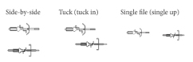
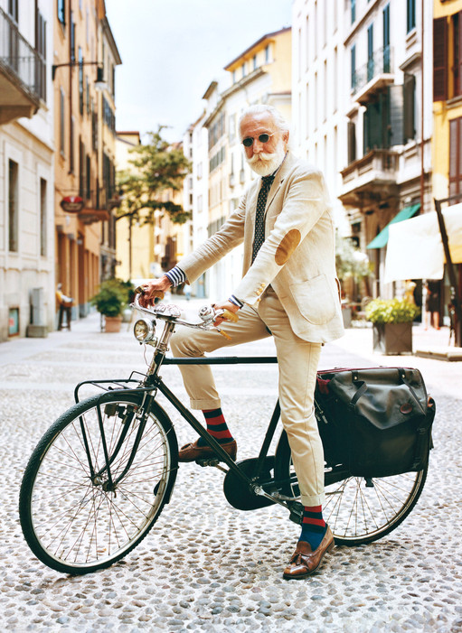

# The sociality of everyday bicycling

#### * * * * *

### random vélomobile
### formations-in-action

* * *

## Background

- Bicycling as a social practice
- Bicycling is embodied
- Social sciences acknowledge the social role of bicycling, and so do bicyclists

* * *

# But commutes are still pretty solitary, right?

#### And running errands stinks

* * *

## Not this!

* * *

## But this!

* * *

## But this!

* * *

### Vélomobile formations-in-action

> specific arrangements of bodies on bikes and configurations of a ‘vélomobile with’

* *vélomobile with* = ‘mobile with’ on bicycles
* *mobile with* = ‘with’ in the context of mobility
* *with* = (opposite to ‘single’) constellation that allows non-solitary social interaction

* * *

## Phenomenon

### Random vélomobile formations-in-action

Two or more people ride
- together
- at the same time
- at a similar pace
- in the same direction
for part of their respective journeys.

Randomness, not intentionality

* * *

## Phenomenon

### Random vélomobile formations-in-action

- “we slip in and out of different ‘mobile withs’”
- “bicycling takes place in complex choreography with other multi-modal road users”

* * *

## Research question

1. How can we *design for social interaction to take place during random encounters of bicyclists* in vélomobile formations-in-action?
How can this (neutral) randomness be turned into (pleasant) *serendipity*?

* * *

## Research question

2. How can random vélomobile formations-in-action be constructively presented in order to *convey a richer account of their experience*?

* * *

## Methodology

* Ethnographic study
	* Observations, recordings
* Surveys, interviews
* Workshops
* Design experiments
	* Bodystorming, experience prototyping, role play

* * *

## Pilot experiment

A visual representation of the 'mobile with':

A time-lapse video (of a bike ride) that plays faster when ever I am alone, and slower the more people I am with.

* * *

## Pilot experiment

### Execution

- Ride a tour with my bike
- Capture stills in short intervals with a camera --- thx @kamfski
- Have a headset awkwardly mounted near my mouth
- Note (audio recording) when ever the number of people around me changes

* * *

## Pilot experiment

### Result

[show the videos here. now. do it!]

* * *

## Pilot experiment

### Reflection

- Next time, make a video
- It was pretty lonely. Next time: better route, rush hour
- Adapting music
- The environmental noise from the ride is missing
- Try a different way to convey ‘being social’, e.g. blur

* * *

# Thanks

