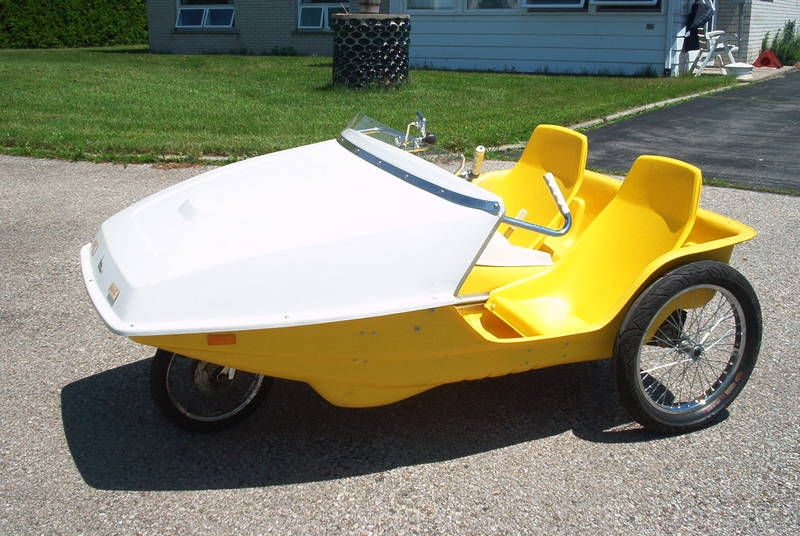

# The sociality of everyday bicycling

## random vélomobile formations-in-action

* * *

Not this!

* * *

## Background

- Bicycling as a social practice
- Bicycling is embodied

* * *

## Phenomenon

* * *

## Methodology

* * *

## Pilot experiment

A visual representation of the 'mobile with':

A time-lapse video (of a bike ride) that plays faster when ever I am alone, and slower the more people I am with.

## Pilot experiment

### Execution

- Ride a tour with my bike
- Capture stills in short intervals with a camera --- thx @kamfski
- Have a headset awkwardly mounted near my mouth
- Note (audio recording) when ever the number of people around me changes

## Pilot experiment

### Result

[show the videos here. now. do it!]

## Pilot experiment

### Reflection

- Next time, make a video
- It was pretty lonely. Next time: better route and rush hour
